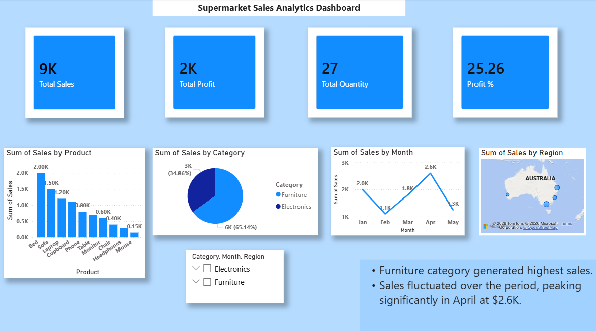

# Supermarket Sales Analytics Dashboard

## Project Overview
An interactive Power BI dashboard designed to analyze retail supermarket performance across key dimensions including sales, profit margins, product categories, and regional performance. 

### Live Preview

---

## Key Performance Indicators (KPIs)
* **Total Sales:** $9K
* **Total Profit:** $2K
* **Total Quantity Sold:** 27 units
* **Profit Margin:** 25.26%

---

## Key Analytical Insights
* **Top Revenue Category:** The **Furniture** category generated the highest overall sales volume ($5.7K), vastly outperforming Electronics ($3.05K).
* **Top Selling Products:** **Beds** and **Sofas** drove the highest individual product revenue, contributing $2.0K and $1.5K respectively.
* **Monthly Performance Trends:** Sales experienced noticeable fluctuations from January to May, achieving a significant peak in **April** at $2.6K before scaling back in May.
* **Regional Drivers:** **Brisbane** emerged as the primary revenue contributor, heavily supported by high-value furniture transactions.

---

## Tech Stack & Skills Demonstrated
* **Tool:** Power BI Desktop
* **Data Modeling:** Power Query (ETL processing, custom conditional column mapping for chronological date sorting)
* **DAX Formulas:** Implemented relational functions (`RELATED`) to bridge data schemas
* **Data Visualization:** Line charts, clustered columns, matrix cards, and geospatial mapping
